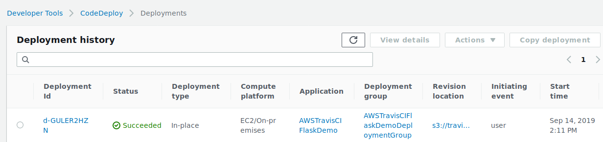
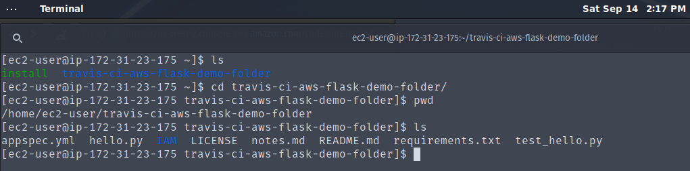

# travis-ci-aws-notes

## Instructions

- Set up Travis-ci for the repo using their website
- Set up AWS per the article below
- Enjoy your set up

### AWS Guide

- ["Comprehensive AWS EC2 Deployment with TravisCI Guide" Medium Article by David Thai](https://medium.com/@itsdavidthai/comprehensive-aws-ec2-deployment-with-travisci-guide-7cafa9c754fc)
  - AWS EC2
  - AWS Codedeploy
  - AWS IAM

#### IAM roles are in the [IAM folder](IAM)

- replace ServerRegionHERE and AccIDHere
- pick a NameOfTheCodeDeployApplicationNameHERE and write it down

#### codedeploy needs to be running on your instance

- https://docs.aws.amazon.com/codedeploy/latest/userguide/codedeploy-agent-operations-install-linux.html
- https://aws-codedeploy-us-west-2.s3.us-west-2.amazonaws.com/latest/install

##### Make sure you change into the right directory if you move files in [appspec.yml](appspec.yml)
- https://stackoverflow.com/questions/51538019/aws-codedeploy-issue-cannot-run-hooks-in-appspec-file

#### AWS CodeDeploy hooks
- https://docs.aws.amazon.com/codedeploy/latest/userguide/reference-appspec-file-structure-hooks.html

#### Flask run commands
- https://flask.palletsprojects.com/en/1.1.x/tutorial/factory/

#### Demo Screenshots

